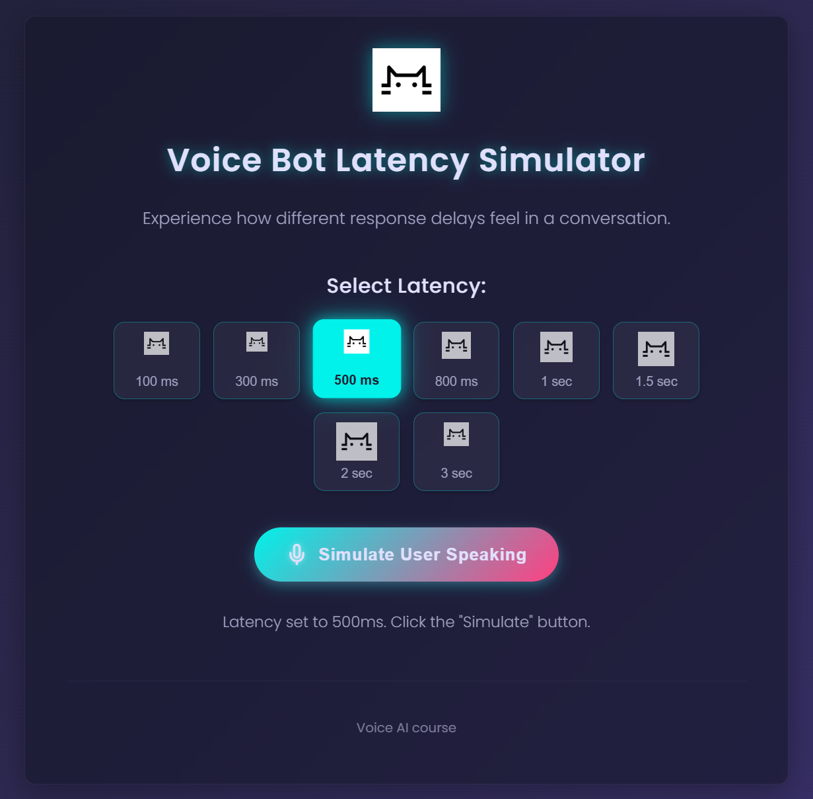
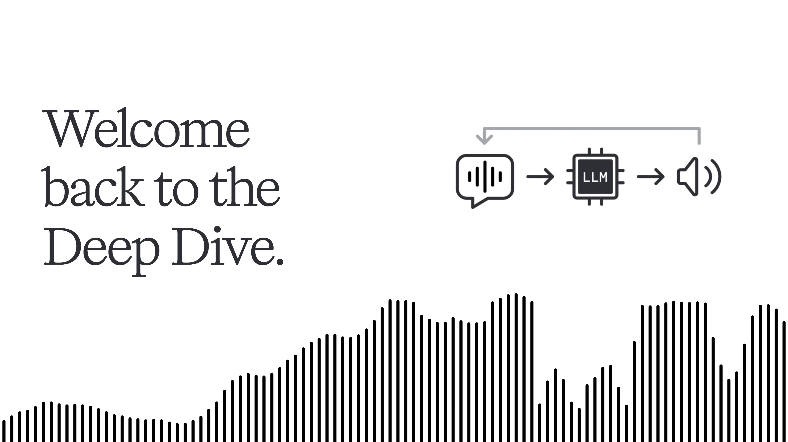
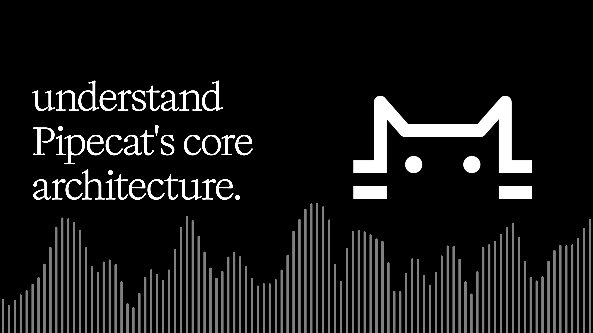

# Showcase

A collection of projects and resources related to voice agents from community members.

## Voice Bot Latency Simulator

- Description: Experience how different response delays feel in a conversation.
- Username: morgymcg
- Date: 2025-05-08 09:54
- Location: [in Discord](https://discord.com/channels/1239284677165056021/1370041616500396153/1370081553941790730)
- Link: https://voice-latency-demo.replit.app/

## Voice AI: An Illustrated Primer Deep Dive

- Description: A NotebookLM podcast episode based on the primer [Voice AI & Voice Agents](https://voiceaiandvoiceagents.com/)
- Username: askjohngeorge
- Date: 2025-05-07 13:50
- Location: [in Discord](https://discord.com/channels/1239284677165056021/1369476628035403816/1369778352973676544)
- Link: https://www.youtube.com/watch?v=RhHS3Mo3Tes

## Pipecat Architecture Deep Dive

- Description: A NotebookLM podcast on the open source Pipecat repository.
- Username: pigeon_supreme
- Date: 2025-05-08 23:40
- Location: [in Discord](https://discord.com/channels/1239284677165056021/1370041616500396153/1370289359374254080)
- Link: https://www.youtube.com/watch?v=7ZLQjJvLLyY

## Session Recaps

Links:
- https://mitjamartini.com/posts/overview-of-voice-ai-landscape/
- https://mitjamartini.com/posts/deploying-voice-agents-to-production/
- https://anfalmushtaq.com/articles/voice-agents-week1-tldr