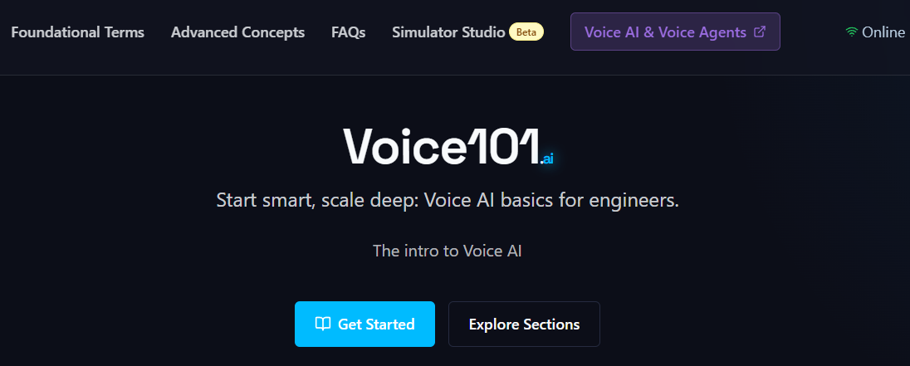

# Showcase

A collection of projects and resources related to voice agents from community members.

## Voice Bot Latency Simulator

- Description: Experience how different response delays feel in a conversation.
- Username: morgymcg
- Date: 2025-05-08 09:54
- Location: [in Discord](https://discord.com/channels/1239284677165056021/1370041616500396153/1370081553941790730)
- Link: https://voice-latency-demo.replit.app/

## Voice AI: An Illustrated Primer Deep Dive

- Description: A NotebookLM podcast episode based on the primer [Voice AI & Voice Agents](https://voiceaiandvoiceagents.com/)
- Username: askjohngeorge
- Date: 2025-05-07 13:50
- Location: [in Discord](https://discord.com/channels/1239284677165056021/1369476628035403816/1369778352973676544)
- Link: https://www.youtube.com/watch?v=RhHS3Mo3Tes

## Pipecat Architecture Deep Dive

- Description: A NotebookLM podcast on the open source Pipecat repository.
- Username: pigeon_supreme
- Date: 2025-05-08 23:40
- Location: [in Discord](https://discord.com/channels/1239284677165056021/1370041616500396153/1370289359374254080)
- Link: https://www.youtube.com/watch?v=7ZLQjJvLLyY

## Voice 101 AI: Voice AI Intro for Engineers

- Description: An interactive platform that teaches engineers the essentials of voice AI through hands-on tutorials and real-world examples.
- Username: sunnypatneedi_17327
- Date: 2025-05-15 15:22
- Location: [in Discord](https://discord.com/channels/1239284677165056021/1260602628803395645/1372670441084289096)
- Link: https://voice101.ai/

## Customer Service Voice Agent for Automotive Business

- Description: A customer service agent built with Pipecat and LlamaIndex using STT->LLM->TTS pipeline. Features RAG-powered business Q&A, appointment scheduling via webhook, and multiple deployment options.
- Username: star2win
- Date: 2025-05-23 18:14
- Location: [in Discord](https://discord.com/channels/1239284677165056021/1374500385187958784/1375597843884150804)
- Link: https://github.com/star2win/customer-service-voice-agent

## Session Recaps

Links:
- https://mitjamartini.com/posts/overview-of-voice-ai-landscape/
- https://mitjamartini.com/posts/deploying-voice-agents-to-production/
- https://anfalmushtaq.com/articles/voice-agents-week1-tldr
- https://anfalmushtaq.com/articles/voice-agents-week2-tldr